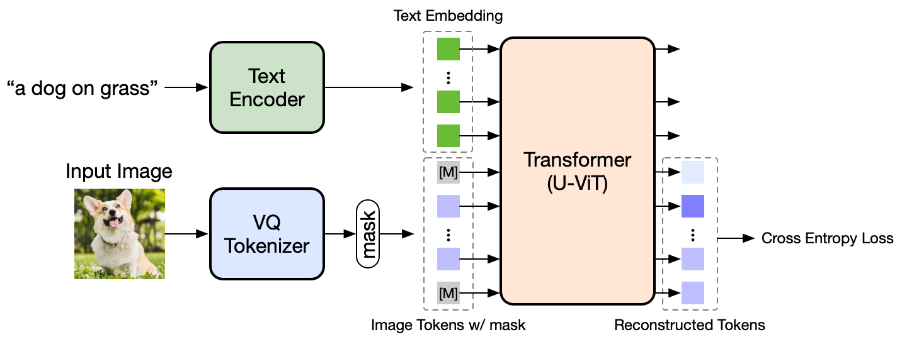

# MUSE-Pytorch🎨

This is a PyTorch implementation of [MUSE](https://arxiv.org/abs/2301.00704) with pre-trained checkpoints on ImageNet and CC3M.

Unlike the original cross-attention conditioning type, we employ an in-context conditioning version of MUSE and adopt the recently proposed [U-ViT](https://github.com/baofff/U-ViT) for its high performance in image generation. A text-to-image version of our implemented pipeline is illustrated below:



Note:

1. Due to computational constraints, the released models are notably undertrained. Nonetheless, they can already achieve satisfactory performance, and we release them to facilitate community research. One can also resume training from the released checkpoints for better results.

2. The core functionality of MUSE is implemented in the `MUSE` class (which is only ~60 lines) in `libs/muse.py`.

## Pretrained Models
The pre-trained models are released in [🤗HuggingFace](https://huggingface.co/nzl-thu/MUSE/tree/main/assets/ckpts), the detailed information is shown below:

| Dataset          |                            Model                             | #Params | #Training iterations | Batch size |       FID       |
| ---------------- | :----------------------------------------------------------: | ------- | -------------------- | ---------- | :-------------: |
| ImageNet 256x256 | [U-ViT-B](https://huggingface.co/nzl-thu/MUSE/tree/main/assets/ckpts/imagenet256-450000.ckpt) (depth=13, width=768) | 102M    | 450K                 | 2048       | 3.84 (12 steps) |
| CC3M             | [U-ViT-Huge](https://huggingface.co/nzl-thu/MUSE/tree/main/assets/ckpts/cc3m-285000.ckpt) (depth=29, width=1152) | 501M    | 285K                 | 2048       | 6.84 (18 steps) |

## Dependencies

```
conda install pytorch torchvision torchaudio cudatoolkit=11.3
pip install accelerate==0.12.0 absl-py ml_collections einops wandb ftfy==6.1.1 transformers==4.23.1 loguru
```

## Data Preparation
First, download VQGAN from this [link](https://drive.google.com/file/d/13S_unB87n6KKuuMdyMnyExW0G1kplTbP/view) (from [MAGE](https://github.com/LTH14/mage), thanks!), and put the downloaded VQGAN in `assets/vqgan_jax_strongaug.ckpt`.

* ImageNet 256x256: Extract ImageNet features by running: `python extract_imagenet_feature.py your/imagenet/path`
* CC3M: 
  * First, prepare some context features for training by running `python extract_test_prompt_feature.py` and `python extract_empty_feature.py`
  * Next, prepare the webdataset `feature2webdataset.py`


## Training & Evaluation

 Download the reference statistics for FID from this [link](https://huggingface.co/nzl-thu/MUSE/tree/main/assets/fid_stats).
Place the downloaded .npz file in `assets/fid_stats`.

Next, download the pre-trained checkpoints from this [link](https://huggingface.co/nzl-thu/MUSE/tree/main/assets/ckpts) to `assets/ckpts` for evaluation or to continue training for more iterations.

#### ImageNet 256x256 (class-conditional)

```shell
# export EVAL_CKPT="assets/ckpts/imagenet256-450000.ckpt"  # uncomment this to perform evaluation. Otherwise, perform training.
export OUTPUT_DIR="output_dir/for/this/experiment"
mkdir -p $OUTPUT_DIR

accelerate launch --num_processes 8 --mixed_precision fp16 train_t2i_discrete_muse.py \
 --config=configs/imagenet256_base_vq_jax.py
```

Expected evaluation results:

```shell
step=450000 fid50000=3.8392620678172307
```

#### CC3M (text-to-image)

```shell
# export EVAL_CKPT="assets/ckpts/cc3m-285000.ckpt"  # uncomment this to perform evaluation. Otherwise, perform training.
export OUTPUT_DIR="output_dir/for/this/experiment"
mkdir -p $OUTPUT_DIR

accelerate launch --num_processes 8 --mixed_precision fp16 train_t2i_discrete_wds.py \
--config=configs/cc3m_xl_vqf16_jax_2048bs_featset_CLIP_G.py
```

Expected evaluation results:

```shell
step=285000 fid30000=6.835978505261096
```

The generated images are stored in `OUTPUT_DIR/eval_samples`. Each time the script is executed, a sub-directory with timestamp will be created to store the generated images.


## This implementation is based on

* [U-ViT](https://github.com/baofff/U-ViT)
* [muse-maskgit-pytorch](https://github.com/lucidrains/muse-maskgit-pytorch)
* [mage](https://github.com/LTH14/mage)
* [maskgit](https://github.com/google-research/maskgit)
* [open-clip](https://github.com/mlfoundations/open_clip)

Thanks to all authors for their work!
